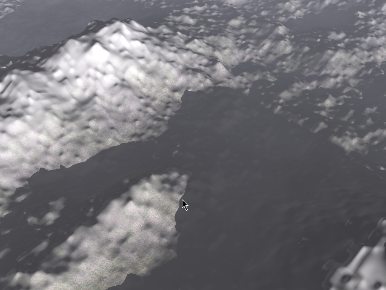

# CIS565 GPU Final Project: Procedural Terrain Generation with Vulkan

__Team: Rudraksha Shah and Mauricio Mutai__

## Project Overview

Currently, many game studios and engines are transitioning or have already transitioned to using Vulkan. However, there aren’t many small teams developing directly with Vulkan. We want to show that even a small team of two can implement a significant project with Vulkan.
Vulkan’s graphics pipeline gives us access to the tessellation control and evaluation shaders. We want to take advantage of them to generate a procedurally generated terrain with varying level of detail. Our final goal is to render the terrain using the three pipelines stated below and conduct a performance analysis comparing the efficiency of each of them.
1. Deferred Rendering Pipeline
2. Forward Rendering Pipeline
3. Visibility Pipeline ( [JCGT](http://jcgt.org/published/0002/02/04/) Paper )
    
    - The JCGT paper provides a variation on the Deferred pipeline in order to make it more efficient. The paper defines a method for a non-tesellated geometry and as our project is tesellation heavy it would be interesting to find a solution that works with our project and the performance impact it has on the rendering. 

## Running the Base Code

- Fork / Clone this repository.
- Go into the directory where you downloaded the project and create a build folder
- `cd` into this build folder in the terminal
- Run: `cmake-gui ..` in the terminal. This should create a window with the source and destiniation directory for the project already populated.
- Make sure you have cmake installed on your system. If not then you can get the latest version from [here](https://cmake.org/download/). 
- Click on `Configure` this should open a pop-up window for you to select the generator. Select: `Visual Studio 14 2015 Win64` and once Configuraion is done, click on `Generate`.
- You are all set. This step should have created a .sln file in your build folder which you can run using Visual Studio.

## Player Controls

- `A & D`: Move camera left right.
- `W & S`: Move camera forward and backward.
- `Q & E`: Move camera up and down.
- `Mouse Right Click`: Press and move to change the orientation of the camera.
- `Mouse Left Click`: Press and move to zoom in and out.

## Features

### LOD Generation

- For generating the terrain we start with a grid of cells. For each cell we store the bottom left corner (Origin) of the cell and pass it to the compute shader. In the compute shader for each cell in the grid we calculate the distance of the edges making up the cell using the origin position of the cell. Now, using the width of the edges and their distance we calculate the LOD for all the edges making up the cell.
- This information then gets sent to the graphics pipeline where we use the tesellation control shader to tesellate the terrain with the calculated LOD and the tesselation evaluation shader to shape the terrain using smooth perlin noise. 

### Texture Mapping

### Shadows

-   The way we generate shadows is by ray-marching from a given position on the terrain along the direction of the sun. While Ray marching we sample the Perlin noise at each step to get the height of the terrain on that point along the ray. If the height of the point along the ray is below the height generated by the noise then that point on the terrain is in shadow.

-   We use the same math involved in generating the offsets for the terrain to generate the  height of the points along the ray which gives us accurate shadows that follow the Silhouette of the terrain.

-   The benefit of ray-marching the shadows is that we can cast dynamic shadows on the terrain in real-time. 

### Skybox & Sun

### Height Based Fog

## Debug Views

Goals
==========
- Base goals:
- Procedurally generated terrain. The terrain is generated using dynamic levels of tessellation in order to achieve varying LOD.
- Forward and Deferred pipelines for comparison purposes.
- Implementation of this paper: http://jcgt.org/published/0002/02/04/
- We want to see if their modification provides any gains in a tessellation-heavy project.
- Integrate texture mapping to further test the paper -- a lot of the gains claimed by the paper come from saving on too-early texture reads
- Stretch Goals (we plan on implementing some of these as “extra features”):
- Procedural rain/snow
- Water simulation
- Shadow mapping
- Simple terrain editing (raise/lower certain areas)
- Support for heightmaps

Project Timeline
============
- 11/20: Have basic forward pipeline with procedurally tessellated terrain and varying LOD
- 11/27: Add deferred pipeline and paper’s pipeline
- 12/04: Implement texture mapping, extra features
- 12/11: Extra features

Resources
==========
We'd like to thank the creators of the resources below for providing valuable insight for this project:
- [The Visibility Buffer: A Cache-Friendly Approach to Deffered Shading](http://jcgt.org/published/0002/02/04/)
- [Sascha Willems' example implementation of a deferred pipeline](https://github.com/SaschaWillems/Vulkan/blob/master/examples/deferred/deferred.cpp)
- [Patricio Gonzalez Vivo's noise functions](https://gist.github.com/patriciogonzalezvivo/670c22f3966e662d2f83)
- [Adrian Biagioli's page on Perlin noise](http://flafla2.github.io/2014/08/09/perlinnoise.html)
- [Plume Tutorials' Tutorial on making a spherical skybox](https://plumetutorials.wordpress.com/2013/10/09/3d-tutorial-making-a-skybox/)
- [Heiko Irrgang's free skybox texture set](https://93i.de/p/free-skybox-texture-set/)

-   [The Visibility Buffer: A Cache-Friendly Approach to Deffered Shading](http://jcgt.org/published/0002/02/04/)
-   [Sascha Willems' example implementation of a deferred pipeline](https://github.com/SaschaWillems/Vulkan/blob/master/examples/deferred/deferred.cpp)
-   [Patricio Gonzalez Vivo's noise functions](https://gist.github.com/patriciogonzalezvivo/670c22f3966e662d2f83)
-   [Adrian Biagioli's page on Perlin noise](http://flafla2.github.io/2014/08/09/perlinnoise.html)
-   [Plume Tutorials' Tutorial on making a spherical skybox](https://plumetutorials.wordpress.com/2013/10/09/3d-tutorial-making-a-skybox/)
-   [Heiko Irrgang's free skybox texture set](https://93i.de/p/free-skybox-texture-set/)
