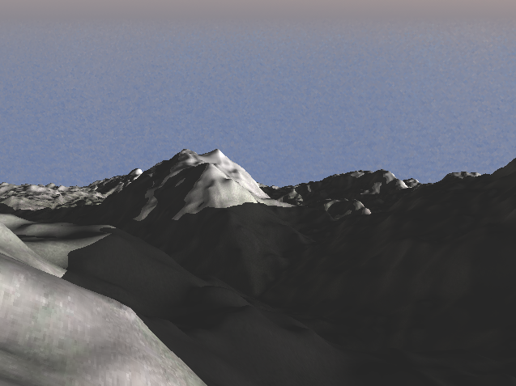
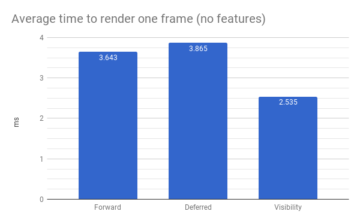
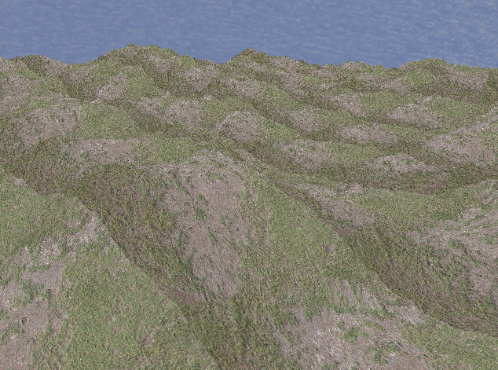

# CIS565 GPU Final Project: Procedural Terrain Generation with Vulkan

__Team: Rudraksha Shah and Mauricio Mutai__

## Project Overview

Currently, many game studios and engines are transitioning or have already transitioned to using Vulkan. However, there aren’t many small teams developing directly with Vulkan. We want to show that even a small team of two can implement a significant project with Vulkan.
Vulkan’s graphics pipeline gives us access to the tessellation control and evaluation shaders. We want to take advantage of them to generate a procedurally generated terrain with varying level of detail. Our final goal is to render the terrain using the three pipelines stated below and conduct a performance analysis comparing the efficiency of each of them.
1. Forward Rendering Pipeline
2. Deferred Rendering Pipeline
3. Visibility Pipeline ([JCGT](http://jcgt.org/published/0002/02/04/) paper)
    - The JCGT paper by Burns and Hunt provides a variation on the deferred pipeline in order to make it more efficient. The paper defines a method for non-tessellated geometry, but only makes suggestions for tessellated geometry. Since our project is tessellation-heavy, we thought it would be interesting to find a more concrete solution that works with our project and analyze the performance impact it has on the rendering. 

## Running the Base Code

- Fork/clone this repository.
- Go into the directory where you downloaded the project and create a `build` folder
- `cd` into this `build` folder in the terminal
- Run: `cmake-gui ..` in the terminal. This should create a window with the source and destiniation directory for the project already populated.
  - On some Windows systems, running CMake from a terminal may not work. Instead, open it through the Start menu and set the "source code" path to the root directory and the "build the binaries" path to the `build` directory.
- Make sure you have CMake installed on your system. If not then you can get the latest version from [here](https://cmake.org/download/). 
- Click on `Configure` this should open a pop-up window for you to select the generator. Select: `Visual Studio 14 2015 Win64` and once Configuraion is done, click on `Generate`.
- You are all set. This step should have created a .sln file in your build folder which you can run using Visual Studio.

## Player Controls

- `A & D`: Move camera left and right.
- `W & S`: Move camera forward and backward.
- `Q & E`: Move camera up and down.
- `Mouse Right Click`: Press and move to change the orientation of the camera.
- `Mouse Left Click`: Press and move to zoom in and out.

## Features

### LOD Generation

- For generating the terrain, we start with a grid of cells. For each cell, we store the bottom left corner (origin) of the cell and pass it to the compute shader. In the compute shader, for each cell in the grid, we calculate the positions of the vertices making up the cell using the origin of the cell. Then, using the distance of each edge to the camera, we calculate the tessellation level for all the edges making up the cell.
  - The farther a given edge is from the camera, the lower its tessellation level will be.
  - The higher the tessellation level, the higher the level of detail (LOD) is for that given edge.
  - By computing tessellation levels per edge, we guarantee that two adjacent edges will have the same level, preventing gaps from appearing.
- This information then gets sent to the graphics pipeline, where we use the tessellation control shader to tessellate the terrain with the calculated LOD. Next, the tessellation evaluation shader shapes the terrain by using smooth Perlin noise to set the height of each point in the tessellated planes. 

### Texture Mapping

"Fun" texture                       | "Fun" texture applied to terrain
:----------------------------------:|:--------------------------------------:
|

- UV mapping is generated for each cell by mapping the origin to UV coordinates (0, 0), the bottom-right corner to (1, 0), the top-left corner to (0, 1), and the top-right corner to (1, 1).
- Each UV coordinate is directly used to sample a specified texture (there is no mip-mapping currently). In the example above, the "fun" texture on the left was used to color the terrain on the right.
- The texture is sampled at different points in each pipeline. This is one of the key differences between the visibility pipeline and the others: the visibility pipeline only samples the texture to shade fragments that are guaranteed to be visible (in its final screen-space render pass), whereas the other pipelines do it at the end of their first render pass.

### Shadows

 With Shadows                         | Without Shadows
:--------------------------------:    | :-------------------------------------: 
  |   

-   Shadows are an important element in any scene. They provode the sense of spatial coherenece between the different elements present in the scene. This effect can be clearly seen in the image above as compared to the lambertian shaded terrain, the terrain with shadows provides a sense of depth, spatial coherence and realism.

-   The way we generate shadows for a given point `P` on the terrain is by ray-marching from `P` along the direction of the sun (we treat the sun as a directional light source with no real position). While ray-marching, we sample the Perlin noise at each step to get the height of the terrain on that point along the ray. If, at any point, the height of the point along the ray is below the height generated by the noise, then `P` is in shadow.
-   We compute the heights above the same way we compute the heights in the tessellation evaluation shader, which gives us accurate shadows that follow the silhouette of the terrain.
-   The benefit of ray-marching the shadows is that we can cast dynamic shadows on the terrain in real-time. 

### Skybox & Sun

#### Skybox

- The skybox is rendered on a screen-space quad `Q` that fills the entire screen. In the forward pipeline, `Q` is a real quad behind all the terrain that is rasterized by a separate pipeline from the cells' pipeline. In the other pipelines, `Q` is not rasterized, but is instead inferred to exist in the fragments that have not been populated with G-buffer or visibility-buffer data.
- Each fragment that lies on `Q` is transformed from screen space to world space using an inverted view-projection matrix. This gives us a world-space point `P` that lies on the line between the camera's eye and the fragment's screen-space position.
- By computing the direction from the camera's world-space position to `P`, we get the direction `D` from the camera to the fragment. By normalizing `D`, we map all points on `Q` to points on a sphere `S` centered around the camera.

- We can then use the coordinates of the point on `S` to sample a "circular" texture like the one below:

- This was the texture used to render the example image at the beginning of this section.
- Traditional skybox cubemaps or rectangular textures can be converted to these "circular" textures through the use of the "Polar Coordinates" filter on Photoshop or GIMP.

#### Sun

- The sun is defined by a direction `D_s`. When shading a fragment, we can check if the fragment's direction `D` from the camera is within a certain angle threshold of `D_s`. If it is, we shade the fragment with a sun-like color.
- To give the appearance of a moving sun `D_s` changes over the time. This sun does not set -- it rotates about the Y axis, essentially.
- To give the illusion of the sun being occluded by clouds, when we determine we are shading the sun, we also sample the texture's color we would have normally used to shade the fragment. If it is not sufficiently blue (this is determined with a check of the form `2.0 * color.b > color.r + color.g`), then we assume the fragment is part of a cloud and we mix the sun's color with the cloud's color.
  - This effect can be seen in the example image at the beginning of this section.
  - Evidently, this does not extend to all skybox textures. A simple and extensible solution would be to load in an additional cloud-map that tells our shader exactly where clouds are (this cloud-map may be generated by an artist, or even with the adequate filters on an image editor).
  - We chose not to pursue this path to reduce the complexity of our pipeline as well as texture accesses.

### Height Based Fog

 With Environmental Fog           | Without Environmental Fog 
:--------------------------------:| :-------------------------------------: 
  |   

- Environmental fog is a very simple way to provide depth to the image, giving a sense of realism to the infinite terrain. Here, we implement a parametric height based fog.
- For each fragment, we calculate the distance of the fragment from the camera and, based on this distance and the fragment's world-space height, we calculate the fog factor. This is a value between [0.0, 1.0] that is used to blend the original fragment color with the fog color. This provides us with a very elegant looking height-based fog.
- Equation for generating the fog factor: `exp(-rayOrigin.y) * (1.0 - exp(-distance * rayDirection.y)) / rayDir.y`

## Performance Analysis

### Preliminary Notes
- Below, we will describe each of the three pipelines we implemented. For each pipeline, we will analyze the performance impact of each of the five features described above.
- We will then make a general comparison of three pipelines in terms of their performance.
- The "average time taken to render a frame" below was measured as an arithmetic mean taken from 1000 frames at a time. When shadows are enabled, this average time tends to fluctuate a fair bit, due to the moving light source. In this case, the mean of five measurements (five averages of 1000 frames) was used as the final number.
- Measurements made on this environment: Windows 10, i7-7700HQ @ 2.2280GHz 16GB, GTX 1050Ti 4GB (Personal Computer)
  - Program was running at a resolution of 640x480.

### Forward Pipeline

- This is a traditional forward pipeline. It performs one render pass to render the terrain directly to a frame buffer, and another pass to render the skybox onto the same frame buffer.
- This pipeline consists of:
  - Compute shader (for dynamic tessellation)
  - Terrain shaders (vertex, tessellation, fragment)
  - Skybox shaders (vertex, fragment)

#### Performance Impact of Each Feature

- Below is a chart displaying the average time taken to render a frame as certain features are enabled in the forward pipeline.

- When no features are enabled, the tessellation level for all cells is set to the maximum level.
- We can see that enabling dynamic tessellation (LOD) provides a noticeable performance improvement.
- Shadows add a considerable delay to our renders, due to the ray-marching process.
- Fog, skybox, and textures seem to barely affect the performance.
- With all features combined, we can see the savings obtained from the dynamic LOD offsets some of the cost of our ray-marched shadows.

### Deferred Pipeline

- The deferred pipeline is an extension of the forward pipeline. It takes the primarily intensive task of shading and *defers* it so that it is done as late as possible. 
- In the standard forward pipeline, the scene geometry is passed to the graphics pipeline, where it is tessellated and rasterized. This generates many fragments per pixel that need to be shaded, but most of these fragments do not make their way to the final image as they are occluded by some geometry, such that they are removed by the depth test that occurs after the fragment shader. This wastes a lot of precious compute and time resources on shading unnecessary fragments.
- The deferred pipeline essentially offsets the shading to a later stage. In the first pass, only the base color of the geometry is stored along with some other information, like the positions and normals, in buffers called `G-buffers`. These G-buffers are sent as texture inputs to the next stage of the pipeline, often called the deferred stage. It is at this stage that the geometry gets shaded. By doing this, only the fragments that are actually visible and contribute to the final image have to be shaded. 
- In our project, this deferred stage also renders the skybox.

- This pipeline consists of:
  - Compute shader (for dynamic tessellation)
  - Terrain shaders (vertex, tessellation, fragment)
  - Deferred shaders (vertex, fragment)
- The G-buffer contains the following data:
  - Albedo (RGB): the color sampled from the texture
  - Position (XYZ): the world-space position of the point being shaded
  - Normal (XY): the world-space surface normal of the point being shaded

#### Performance Impact of Each Feature

- Below is a chart displaying the average time taken to render a frame as certain features are enabled in the deferred pipeline.

- Similar to the forward pipeline, dynamic LOD improves our performance, while fog, skybox, and textures have a minimal effect.
- The relative cost of ray-marched shadows is noticeably lower when compared to the forward pipeline. In the deferred pipeline, shadows increase the render time by 13.2%, while in the forward pipeline, render time grows by 82.3%.
  - This makes sense when we consider that the deferred pipeline, as its name suggests, defers the shadow ray-march to the second render pass. As a result, it only performs the computation for visible fragments, while the forward pipeline does it for all fragments generated by rasterization. 
- Similar to the forward pipeline, when all features are enabled, the improvement from the dynamic LOD offsets the cost of our ray-marched shadows. In fact, we can see it offsets it enough to make the all-features performance slightly better than the no-features case!

### Visibility Pipeline

- The visibility pipeline proposed by Burns and Hunt in their JCGT paper is similar to the deferred pipeline in that they both offset shading to a later stage. They both have buffers that are filled with some information that are passed as textures to be read from to the shading stage. The primary difference between them is that the `Visibility-buffer` (analogous to the deferred pipeline's `G-buffer`) is smaller compared to the `G-buffer`.
- In the JCGT paper, the visibility pipeline stores only the triangle index and instance ID per fragment for non-tessellated geometry. In our implementation for a tesellated geometry we only store the UV values (for texture mapping) and the XZ world-space position of the terrain. 
   - We store the XZ coordinates because that is enough to re-compute the noise, which gives us the Y coordinate of the point. Having the entire world-space position and access to the noise function, we can re-compute the normals as well. Finally, we can use the UVs to sample the texture. In this way, we re-compute other data that would have normally been stored in the `G-buffer`.
- The reduced information stored in the buffer directly implies lower storage and bandwidth requirements and could lead to a good performance boost for mobile devices.
- Similar to the deferred pipeline, the visibility pass renders the skybox in our project.

- This pipeline consists of:
  - Compute shader (for dynamic tessellation)
  - Terrain shaders (vertex, tessellation, fragment)
  - Deferred shaders (vertex, fragment)
- The visibility buffer contains the following data:
  - Position (XZ): the world-space position of the point being shaded
  - UV: the UV coordinates of the point being shaded

#### Performance Impact of Each Feature

- Below is a chart displaying the average time taken to render a frame as certain features are enabled in the visibility pipeline.

- Similar to the forward pipeline, dynamic LOD improves our performance, while fog, skybox, and textures have a minimal effect.
- The relative cost of ray-marched shadows (46.2%) is between those of the deferred and forward pipelines.
- Similar to the forward pipeline, when all features are enabled, the improvement from the dynamic LOD offsets the cost of our ray-marched shadows.

### Comparison of Pipelines

#### No Features Enabled

- Below is a chart comparing the average time taken to render a frame for all pipelines when no features are enabled.

- Interestingly, the deferred pipeline's performance is slightly worse than the forward pipeline's in this case. This is likely due to the additional overhead incurred by the G-buffer.
- The visibility pipeline has the best performance here. This is likely due to the lower overhead of the visibility buffer, which greatly reduces delays from memory transfers, as well as the savings from performing late shading (Lambertian shading was still enabled).

#### Shadows Only

- Below is a chart comparing the average time taken to render a frame for all pipelines when only shadows are enabled.

- The forward pipeline is significantly slower than the deferred and visibility pipelines. This makes sense, since it computes shadows for all rasterized fragments, while the two other pipelines only do it for a subset of those (the visible fragments).
- Again, the reduced memory bandwidth requirements of the visibility pipeline are probably the cause for its better performance relative to the deferred one.

#### All Features Enabled

- Below is a chart comparing the average time taken to render a frame for all pipelines when all features are enabled.

- Like before, the forward pipeline is significantly slower than the deferred and visibility pipelines, while the visibility pipeline is slighly faster than the deferred one. 
- The shape of this graph is also similar to the one for when only shadows are enabled.
  - This makes sense when we consider that:
    - Dynamic LOD should provide a similar improvement in performance to all pipelines, since it affects their first pass (terrain tessellation and rasterization) equally.
    - The other features don't affect performance significantly.
  - Thus, the performance drop caused by ray-marched shadows is what mainly determines the relative performance across pipelines.

## Conclusions About Paper

- We expected texture mapping to create the gap in performance between the deferred and forward pipelines. However, in both cases, the performance impact of that feature was very small. Perhaps Vulkan is too well-optimized!
- The paper's visibility buffer really shines at reducing the memory bandwidth required to shade a given fragment. It essentially replaces memory transfers with computations. This definitely makes sense, since memory bandwidth and accesses are known to be very slow (in both GPUs and CPUs) relative to performing computations.

## Debug Views 

### Normals

### Wireframe Mesh

### Albedo

### UVs

## Bloopers

- We had this interesting issue where, if we moved the camera too far from the origin, the terrain and shadows would become very pixellated. This only happened in the deferred and visibility pipelines.
- As one might expect, the root cause of this was in the data stored by the G-buffer or visibility buffer.
- More specifically, after some debugging, we noticed that the UV values stored in the visibility buffer never became pixellated, no matter how far the camera moved. However, the XZ coordinates did become more visibly discretized as the camera moved farther from the origin.
  - This led to the insight that UV coordinates were unaffected because they are always in the range [0, 1], whereas the XZ coordinates grew unbounded.
  - This became an issue because we were storing each component of UVs and XZ coordinates as 16-bit floating point numbers. This is a lower precision than the 32-bit floating point numbers used internally when the shader is running. The lower precision becomes more pronounced when storing values that grow unbounded like the XZ coordinates.
- The solution to this was to limit the XZ coordinates to a certain range. Luckily, we were sort of doing that already when we initialized the terrain cells -- they are all initialized to be within a range of values from the origin. We achieve the effect of the tiles "following" the camera by adding an offset to the cells' positions based on where the camera is.
  - Note this offset must be a multiple of the cell dimensions, otherwise we would get inconsistent terrain due to variations in sampling the noise function.
- The final solution was to undo this offsetting when storing the XZ coordinates in a buffer and then re-applying the offset after reading the values from the texture. This allowed us to make the most use of the texture's limited 16-bit precision.
  - This is referred to as "the precision fix" in some commits and comments within the code.

## Goals
- Base goals:
  - Procedurally generated terrain. The terrain is generated using dynamic levels of tessellation in order to achieve varying LOD.
  - Forward and Deferred pipelines for comparison purposes.
  - Implementation of this paper: http://jcgt.org/published/0002/02/04/
    - We want to see if their modification provides any gains in a tessellation-heavy project.
  - Integrate texture mapping to further test the paper -- a lot of the gains claimed by the paper come from saving on too-early texture reads
- Stretch Goals (we plan on implementing some of these as “extra features”):
  - Procedural rain/snow
  - Water simulation
  - Shadow mapping
  - Simple terrain editing (raise/lower certain areas)
  - Support for heightmaps

## Project Timeline
- 11/20: Have basic forward pipeline with procedurally tessellated terrain and varying LOD
- 11/27: Add deferred pipeline and paper’s pipeline
- 12/04: Implement texture mapping, extra features
- 12/11: Extra features, performance analysis

## Resources
We'd like to thank the creators of the resources below for providing valuable insight for this project:
- [The Visibility Buffer: A Cache-Friendly Approach to Deferred Shading](http://jcgt.org/published/0002/02/04/)
- [Sascha Willems' example implementation of a deferred pipeline](https://github.com/SaschaWillems/Vulkan/blob/master/examples/deferred/deferred.cpp)
- [Patricio Gonzalez Vivo's noise functions](https://gist.github.com/patriciogonzalezvivo/670c22f3966e662d2f83)
- [Adrian Biagioli's page on Perlin noise](http://flafla2.github.io/2014/08/09/perlinnoise.html)
- [Plume Tutorials' tutorial on making a spherical skybox](https://plumetutorials.wordpress.com/2013/10/09/3d-tutorial-making-a-skybox/)
- [Heiko Irrgang's free skybox texture set](https://93i.de/p/free-skybox-texture-set/)
- Adam Mally, for inspiring the skybox with moving sun
- [Íñigo Quílez' article on environmental fog](http://www.iquilezles.org/www/articles/fog/fog.htm)