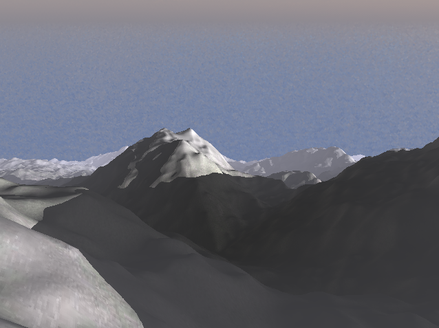

# CIS565 GPU Final Project: Procedural Terrain Generation with Vulkan

__Team: Rudraksha Shah and Mauricio Mutai__

## Project Overview

Currently, many game studios and engines are transitioning or have already transitioned to using Vulkan. However, there aren’t many small teams developing directly with Vulkan. We want to show that even a small team of two can implement a significant project with Vulkan.
Vulkan’s graphics pipeline gives us access to the tessellation control and evaluation shaders. We want to take advantage of them to generate a procedurally generated terrain with varying level of detail. Our final goal is to render the terrain using the three pipelines stated below and conduct a performance analysis comparing the efficiency of each of them.
1. Deferred Rendering Pipeline
2. Forward Rendering Pipeline
3. Visibility Pipeline ( [JCGT](http://jcgt.org/published/0002/02/04/) Paper )
    
    - The JCGT paper provides a variation on the Deferred pipeline in order to make it more efficient. The paper defines a method for a non-tesellated geometry and as our project is tesellation heavy it would be interesting to find a solution that works with our project and the performance impact it has on the rendering. 

## Running the Base Code

- Fork / Clone this repository.
- Go into the directory where you downloaded the project and create a `build` folder
- `cd` into this `build` folder in the terminal
- Run: `cmake-gui ..` in the terminal. This should create a window with the source and destiniation directory for the project already populated.
  - On some Windows systems, running CMake from a terminal may not work. Instead, open it through the Start menu and set the "source code" path to the root directory and the "build the binaries" path to the `build` directory.
- Make sure you have CMake installed on your system. If not then you can get the latest version from [here](https://cmake.org/download/). 
- Click on `Configure` this should open a pop-up window for you to select the generator. Select: `Visual Studio 14 2015 Win64` and once Configuraion is done, click on `Generate`.
- You are all set. This step should have created a .sln file in your build folder which you can run using Visual Studio.

## Player Controls

- `A & D`: Move camera left right.
- `W & S`: Move camera forward and backward.
- `Q & E`: Move camera up and down.
- `Mouse Right Click`: Press and move to change the orientation of the camera.
- `Mouse Left Click`: Press and move to zoom in and out.

## Features

### LOD Generation

- For generating the terrain we start with a grid of cells. For each cell we store the bottom left corner (Origin) of the cell and pass it to the compute shader. In the compute shader for each cell in the grid we calculate the distance of the edges making up the cell using the origin position of the cell. Now, using the width of the edges and their distance we calculate the LOD for all the edges making up the cell.
- This information then gets sent to the graphics pipeline where we use the tesellation control shader to tesellate the terrain with the calculated LOD and the tesselation evaluation shader to shape the terrain using smooth perlin noise. 

### Texture Mapping

"Fun" texture                       | "Fun" texture applied to terrain
:----------------------------------:|:--------------------------------------:
|

- UV mapping is generated for each cell by mapping the origin to UV coordinates (0, 0), the bottom-right corner to (1, 0), the top-left corner to (0, 1), and the top-right corner to (1, 1).
- Each UV coordinate is directly used to sample a specified texture (there is no mip-mapping currently). In the example above, the "fun" texture on the left was used to color the terrain on the right.
- The texture is sampled at different points in each pipeline. This is one of the key differences between the visibility pipeline and the others: the visibility pipeline only samples the texture to shade fragments that are guaranteed to be visible (in its final screen-space render pass), whereas the other pipelines do it at the end of their first render pass.

### Shadows

-   The way we generate shadows is by ray-marching from a given position on the terrain along the direction of the sun. While Ray marching we sample the Perlin noise at each step to get the height of the terrain on that point along the ray. If the height of the point along the ray is below the height generated by the noise then that point on the terrain is in shadow.

-   We use the same math involved in generating the offsets for the terrain to generate the  height of the points along the ray which gives us accurate shadows that follow the Silhouette of the terrain.

-   The benefit of ray-marching the shadows is that we can cast dynamic shadows on the terrain in real-time. 

### Skybox & Sun

#### Skybox

- The skybox is rendered on a screen-space quad `Q` that fills the entire screen. In the forward pipeline, `Q` is a real quad behind all the terrain that is rasterized by a separate pipeline from the cells' pipeline. In the other pipelines, `Q` is not rasterized, but is instead inferred to exist in the fragments that have not been populated with G-buffer or visibility-buffer data.
- Each fragment that lies on `Q` is transformed from screen space to world space using an inverted view-projection matrix. This gives us a world-space point `P` that lies on the line between the camera's eye and the fragment's screen-space position.
- By computing the direction from the camera's world-space position to `P`, we get the direction `D` from the camera to the fragment. By normalizing `D`, we map all points on `Q` to points on a sphere `S` centered around the camera.

(TODO: add diagram here)

- We can then use the coordinates of the point on `S` to sample a "circular" texture like the one below:

- This was the texture used to render the example image at the beginning of this section.
- Traditional skybox cubemaps or rectangular textures can be converted to these "circular" textures through the use of the "Polar Coordinates" filter on Photoshop or GIMP.

#### Sun

- The sun is defined by a direction `D_s`. When shading a fragment, we can check if the fragment's direction `D` from the camera is within a certain angle threshold of `D_s`. If it is, we shade the fragment with a sun-like color.
- To give the appearance of a moving sun `D_s` changes over the time. This sun does not set -- it rotates about the Y axis, essentially.
- To give the illusion of the sun being occluded by clouds, when we determine we are shading the sun, we also sample the texture's color we would have normally used to shade the fragment. If it is not sufficiently blue (this is determined with a check of the form `2.0 * color.b > color.r + color.g`), then we assume the fragment is part of a cloud and we mix the sun's color with the cloud's color.
  - This effect can be seen in the example image at the beginning of this section.
  - Evidently, this does not extend to all skybox textures. A simple and extensible solution would be to load in an additional cloud-map that tells our shader exactly where clouds are (this cloud-map may be generated by an artist, or even with the adequate filters on an image editor).
  - We chose not to pursue this path to reduce the complexity of our pipeline as well as texture accesses.

### Height Based Fog

| With Fog | Without Fog |
| --- | --- |
|  |   |

-   Environmental fog is a very simple way to provide depth to the image. Giving a sense of realism to the infinite terrain. Here, we implement a parametric height based fog.

-   For each fragment we calculate the distance of the fragment from the camera and based on the distance and the height we calculate the fog factor which is a value between [0.0, 1.0] that is used to blend the frame color with the fog color. This provides us with a very elegant looking height based fog.

-   Equation for generating the fog factor: `exp(-rayOri.y) * (1.0-exp( -distance*rayDir.y))/rayDir.y`

## Performance Analysis

- Below, we will describe each of the three pipelines we implemented. For each pipeline, we will analyze the performance impact of each of the five features described above.
- We will then make a general comparison of three pipelines in terms of their performance.

### Forward Pipeline

- This is a traditional forward pipeline. It performs one render pass to render the terrain directly to a frame buffer, and another pass to render the skybox onto the same frame buffer.
- This pipeline consists of:
  - Compute shader (for dynamic tessellation)
  - Terrain shaders (vertex, tessellation, fragment)
  - Skybox shaders (vertex, fragment)

#### Performance Impact of Each Feature

- Below is a chart displaying the average time taken to render a frame as certain features are enabled in the forward pipeline.

- When no features are enabled, the tessellation level for all cells is set to the maximum level.
- We can see that enabling dynamic tessellation (LOD) provides a noticeable performance improvement.
- Shadows add a considerable delay to our renders, due to the ray-marching process.
- Fog, skybox, and textures seem to barely affect the performance.
- With all features combined, we can see the savings obtained from the dynamic LOD offsets some of the cost of our ray-marched shadows.

### Deferred Pipeline

-    The deferred pipeline is an extension of the forward pipeline. It takes the primarily intensive task of shading which is highly dependent on the scene complexity and make it dependent on the image size. In the standard forward pass the scene geometry gets passed to the graphics pipeline which gets tesellated and rasterized. This generates a bunch of fragments per pixel that need to be shaded and most of these fragments do not make their way to the final image as they are occuluded by some geometry and are usually removed by the depth test that occures after the fragment shader. This wastes a lot of precious compute and time resources on shading un-necessary fragments.
-    The deferred pipeline essentially offsets the shading to a later stage. In the first pass only the base color of the geometry is stored along with some other information like the position and normals in buffers called `G-buffers`. These G-buffers are sent as texture input to the next stage of the pipeline often called the deferred stage. it is at this stage that the geometry gets shaded and only for those fragments that are actually visible and that contribute to the final image. 

- This deferred stage also renders the skybox.

- This pipeline consists of:
  - Compute shader (for dynamic tessellation)
  - Terrain shaders (vertex, tessellation, fragment)
  - Deferred shaders (vertex, fragment)
- The G-buffer contains the following data:
  - Albedo (RGB): the color sampled from the texture
  - Position (XYZ): the world-space position of the point being shaded
  - Normal (XY): the world-space surface normal of the point being shaded

#### Performance Impact of Each Feature

- Below is a chart displaying the average time taken to render a frame as certain features are enabled in the deferred pipeline.

- Similar to the forward pipeline, dynamic LOD improves our performance, while fog, skybox, and textures have a minimal effect.
- The relative cost of ray-marched shadows is noticeably lower when compared to the forward pipeline. In the deferred pipeline, shadows increase the render time by 13.2%, while in the forward pipeline, render time grows by 82.3%.
  - This makes sense when we consider that the deferred pipeline, as its name suggests, defers the shadow ray-march to the second render pass. As a result, it only performs the computation for visible fragments, while the forward pipeline does it for all fragments generated by rasterization. 
- Similar to the forward pipeline, when all features are enabled, the improvement from the dynamic LOD offsets the cost of our ray-marched shadows. In fact, we can see it offsets it enough to make the all-features performance slightly better than the no-features case!

### Visibility Pipeline

-   The visibility pipeline is similar to the deferred pipeline in the way that they both offset shading to a later stage. They both have buffers that are filled with some information that are passed as texture to be read from to the shading stage. The primary difference between the visibility pipeline is that the `G-buffer` or `Visibility-buffer` is smaller and is filled with compact data as compared to the `G-buffers` in the visibility pipeine.
-   The visbility pipeline also does not store the albedo, position and normal in the fisrt pass but rather it stores the triangle index and instance ID per sample for a non-tesellated geometry and as per our implementation for a tesellated geometry we only store the UV values and the XZ position of the terrain. The less information stored in the buffer directly means a lesser storage and bandwidth requirment and promices a good performance boost for mobile devices.  

- Similar to the deferred pipeline the visibility pass renders the skybox.

- This pipeline consists of:
  - Compute shader (for dynamic tessellation)
  - Terrain shaders (vertex, tessellation, fragment)
  - Deferred shaders (vertex, fragment)
- The visibility buffer contains the following data:
  - Position (XZ): the world-space position of the point being shaded
  - UV: the UV coordinates of the point being shaded

#### Performance Impact of Each Feature

- Below is a chart displaying the average time taken to render a frame as certain features are enabled in the visibility pipeline.

- Similar to the forward pipeline, dynamic LOD improves our performance, while fog, skybox, and textures have a minimal effect.
- The relative cost of ray-marched shadows (46.2%) is between those of the deferred and forward pipelines.
- Similar to the forward pipeline, when all features are enabled, the improvement from the dynamic LOD offsets the cost of our ray-marched shadows. In fact, we can see it offsets it enough to make the all-features performance slightly better than the no-features case!

### Comparison of Pipelines

## Debug Views 

### Normals

### Wireframe Mesh

### albedo

Goals
==========
- Base goals:
- Procedurally generated terrain. The terrain is generated using dynamic levels of tessellation in order to achieve varying LOD.
- Forward and Deferred pipelines for comparison purposes.
- Implementation of this paper: http://jcgt.org/published/0002/02/04/
- We want to see if their modification provides any gains in a tessellation-heavy project.
- Integrate texture mapping to further test the paper -- a lot of the gains claimed by the paper come from saving on too-early texture reads
- Stretch Goals (we plan on implementing some of these as “extra features”):
- Procedural rain/snow
- Water simulation
- Shadow mapping
- Simple terrain editing (raise/lower certain areas)
- Support for heightmaps

Project Timeline
============
- 11/20: Have basic forward pipeline with procedurally tessellated terrain and varying LOD
- 11/27: Add deferred pipeline and paper’s pipeline
- 12/04: Implement texture mapping, extra features
- 12/11: Extra features

Resources
==========
We'd like to thank the creators of the resources below for providing valuable insight for this project:
- [The Visibility Buffer: A Cache-Friendly Approach to Deffered Shading](http://jcgt.org/published/0002/02/04/)
- [Sascha Willems' example implementation of a deferred pipeline](https://github.com/SaschaWillems/Vulkan/blob/master/examples/deferred/deferred.cpp)
- [Patricio Gonzalez Vivo's noise functions](https://gist.github.com/patriciogonzalezvivo/670c22f3966e662d2f83)
- [Adrian Biagioli's page on Perlin noise](http://flafla2.github.io/2014/08/09/perlinnoise.html)
- [Plume Tutorials' Tutorial on making a spherical skybox](https://plumetutorials.wordpress.com/2013/10/09/3d-tutorial-making-a-skybox/)
- [Heiko Irrgang's free skybox texture set](https://93i.de/p/free-skybox-texture-set/)
- Adam Mally, for inspiring the skybox with moving sun
- [Environmental Fog](http://www.iquilezles.org/www/articles/fog/fog.htm)